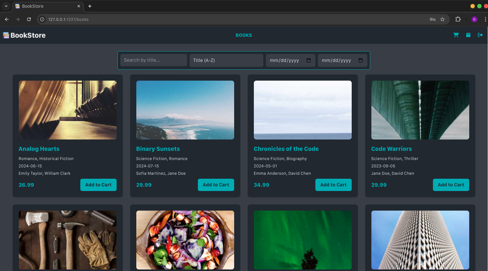

# BookStore

BookStore is a comprehensive web application for an online bookstore, serving as both a consolidation of my current web development knowledge and a platform for exploring new technologies and practices. This project represents a culmination of my skills while also pushing the boundaries of my expertise into new areas.

## Screenshots





## Table of Contents
- [Features](#features)
- [Technologies](#technologies)
- [Getting Started](#getting-started)
  - [Prerequisites](#prerequisites)
  - [Installation](#installation)
- [Usage](#usage)
- [Testing](#testing)
- [API Documentation](#api-documentation)

## Features

- Automatic creation of superuser based on environment variables
- Extensive book catalog with search and filter functionality
- User registration and authentication system
- Shopping cart and order management
- Sending order confirmation emails to users
- *in progres...*

## Technologies

- Backend: Python v3.12, Django v5.0, Django REST Framework v3.15
- Frontend: Next.js v14.2, React v18
- Database: PostgreSQL v16.0
- Authentication: SimpleJWT v5.3
- Testing: pytest-django v4.8
- Server: Gunicorn v22.0
- Proxy: Nginx v1.27
- Containerization: Docker v27.2, Docker Compose v2.22
- Distributed Task Queue: Celery v5.4.0
- Message Broker: Redis v7.4
- *in progres...*

## Getting Started

### Prerequisites

- Docker and Docker Compose
- *in progres...*

### Installation

1. Clone the repository:
   ```
   git clone https://github.com/dejvinczi/bookstore.git
   cd bookstore
   ```
2. Create .env file from .env.template and edit it. (**🚨IMPORTANT** - There is no proxy server in the development environment - it exists only in the test and production environment. If you want to make queries to the API in the development environment, you need to set **NEXT_PUBLIC_API_PORT=8000** pointing directly to the Django server.
   ```
   cp .env.template .env
   ```

3. Build the Docker containers (choose one of the following as appropriate):

   3.1. Development composition:
   ```
   docker-compose -f development.yaml build
   ```
   3.2. Testing composition:
   ```
   docker-compose -f testing.yaml build
   ```
   3.3. Production composition:
   ```
   docker-compose -f production.yaml build
   ```
## Usage

1. Navigate to the root directory of the repository:
   ```
   cd bookstore
   ```

2. Run the Docker containers (choose one of the following as appropriate):

   2.1. Development composition:
   ```
   docker-compose -f development.yaml up
   ```
   2.2. Testing composition:
   ```
   docker-compose -f testing.yaml up
   ```
   2.3. Production composition:
   ```
   docker-compose -f production.yaml up
   ```

3. Navigate your browser to url:

   3.1. Development composition:
   - Frontend: http://localhost:3000
   - Backend: http://localhost:8000

   3.2. Production composition:
   - http://localhost:1337

## Testing

You can run tests with coverage using `pytest` on the testing server:


1. Navigate to the root directory of the repository:
   ```
   cd bookstore
   ```

2. Run docker testing composition:
   ```
   docker-compose -f testing.yaml up
   ```

3. In another terminal run the following command:
   ```
   docker-compose -f testing.yaml exec api pytest
   ```


## API Documentation

API documentation is available when the development server is running at:
1. Swagger:  `http://localhost:8000/api/schema/swagger-ui/`
2. Redoc:  `http://localhost:8000/api/schema/redoc/`
3. JSON:  `http://localhost:8000/api/schema/`
